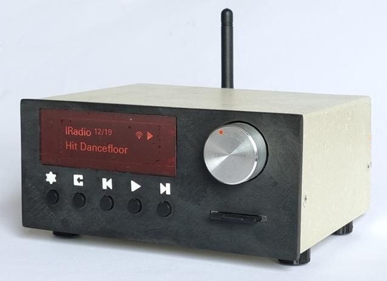

# ESP32_MP
## CD Quality Digital Audio Player and Streamer

You can watch a video explanation of this project [HERE](https://pages.github.com/)

### This repo contains a complete project of Audio Player that implements:

*  Play from SD Card
*  Streaming from Internet Radio
*  Streaming from UPnP media server
*  Streamin from Bluetooth

### The main features are:

*  OLED Display for real time information
*  Button and knob to full control
*  Operated remotely with a IR remote control
*  Advanced Web Server for radio station manage

Supported audio formats: 	MP3, FLAC, WAV, AAC (up to 48 kHz, 16 bit)  
Maximum bit rate: 	1440 kbit/s (FLAC, WAV) 320 kbit/s (MP3, AAC)

### User Manuals:
See the manuals section for complete information
